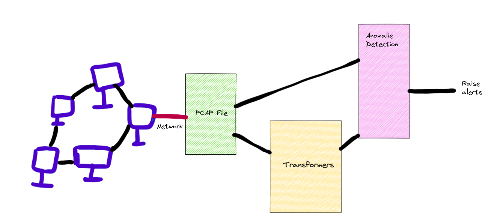
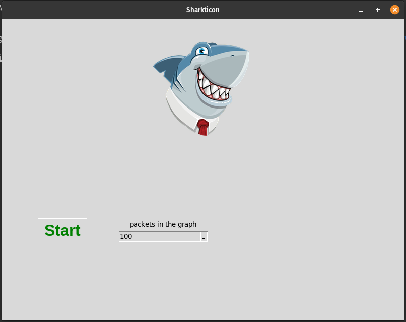
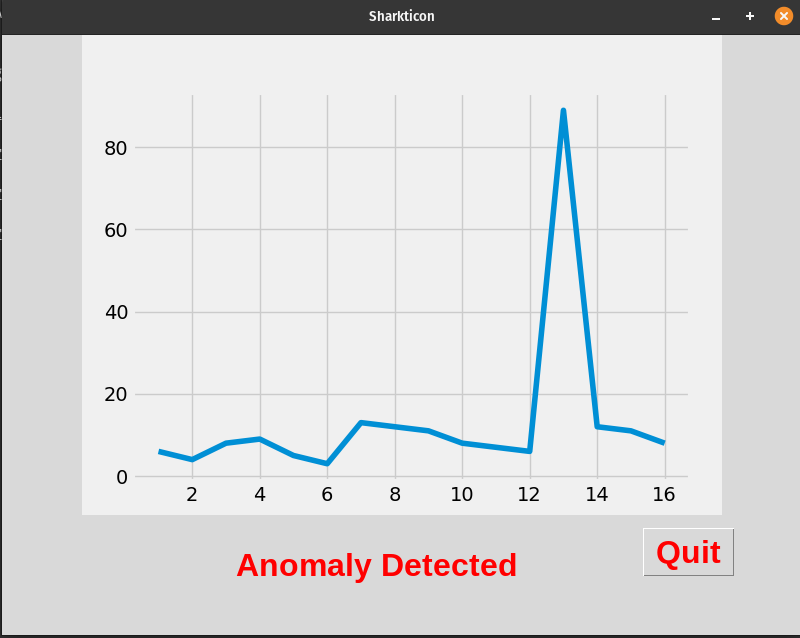
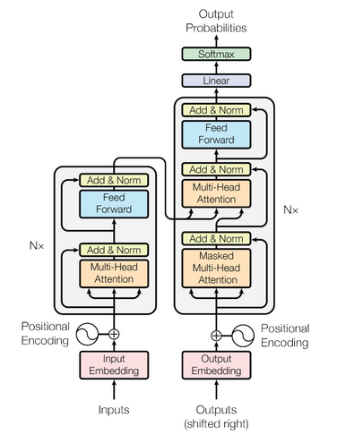

# Sharkticon

## Description

Sharkticon is an intrusion detection system.

Its specificity is that it uses an anomaly detection system and machine learning, notably the transformers architecture.

Indeed, currently the most known IDS (intrusion detection system) use database of attack signatures to detect attacks.

Obviously a problem arises, if these systems face new attacks. This is not the case with our IDS, which is able to detect attacks that it has never seen thanks to anomaly detection.

See below a schema of the current architecture 



Our software consists of two parts.\
A first configuration window that will ask you the number of packets you want to see on the graph\
then in the future the protocol or protocols on which you want to focus the analysis

 <p align="center">
    
 </p>

Then a loading time will take place while the model is being trained on your network,\
then a real time graph will be displayed where you can see the stability of your network.\
If an anomaly is detected it will be displayed and saved in the log files.

 <p align="center">
    
 </p>

Here is the list of supported protocols :


|        Protocols                             | Operational |
|:------------------------------------------:|:-----------:|
|HTTP        | :heavy_check_mark: |
| UDP| :x: |
| TCP | :x: |

## Installation

```
 git clone https://github.com/PoCInnovation/Sharkticon.git
 cd Sharkticon
 pip3 install -r requirements.txt
```
## Quick Start

```
Sharkticon
or
Sharkticon --cli
```

If you use the CLI, you will have less information \
but the essentials like alerts will be available.

## Explanation

Sharkticon uses Wireshark to retrieve the network stream.
is then processed by a python script to render it in the format of our model.

For our model we use the transformers architecture, being the state of the art in NLP, we have adapted it and used it in our project. That's why we have focused on the HTTP protocol which is more verbose and therefore where the transformers exploits its qualities at best.

<p align="center">
    <br/>
  
  <br/>
  <br/>
</p>

Our model makes a prediction of the next packet from the previous ones, we then use our anomaly detection algorithm to detect if the packet is malicious, if X packets are malicious in a Y time frame then we raise an alert.


## Modules
Our software is divided into two main parts, training and analysis. Here is the list of features

### Current

|        Features                             | Description |
|:------------------------------------------:|:-----------:|
|Training        | First, the software proposes to train the model for your network flow |
| Analyze Networks| Then, the model will analyze your network by displaying a graph that will show you the stability of your network |
| Anomalie Detection | Packet predictions will be processed by our anomaly detection algorithm, an alert will be displayed if an anomaly is detected |
| Logs Manager | All your alerts will be grouped in a log folder with the date and time of the anomaly | 

------------
## Maintainers

 - [Mikaël Vallenet](https://github.com/Mikatech)
 - [Evan Sabre](https://github.com/EvanSabre)
